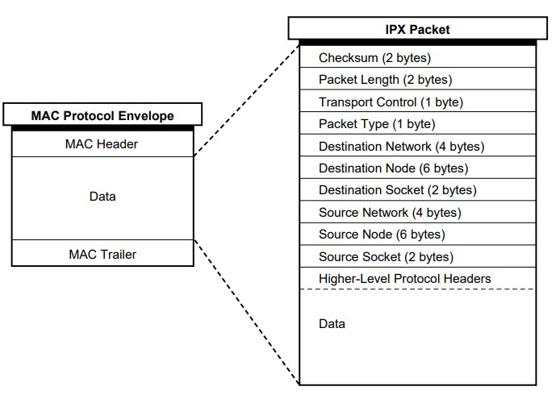
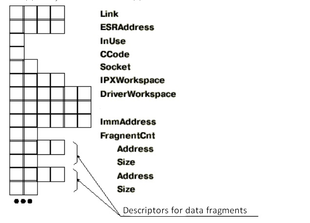

# dos-ipx

Simple implementation of basic functions of `IPX protocol` for `DOS`.

You can compile it yourself with `TurboC` (tested for version `2.01`).

[Provided compiled version](https://github.com/DanArmor/dos-ipx/releases/tag/v1.0.0) in tags as `.obj`.

If you want to read some good IPX code - [DOOM(1993)](https://github.com/id-Software/DOOM/tree/master/ipx) is using it for multiplayer game.

Format of packet:

Format of ECB - application use it for sending/receiving packet.

## Resources

* [IPX Documentation](https://www.novell.com/documentation/nw6p/pdfdoc/ipx_enu/ipx_enu.pdf)
* [IPX (RU)](https://frolov-lib.ru/books/bsp.old/v08/ch2.htm)
* [TurboC User Guid](http://bitsavers.informatik.uni-stuttgart.de/pdf/borland/turbo_c/Turbo_C_Users_Guide_1987.pdf)
